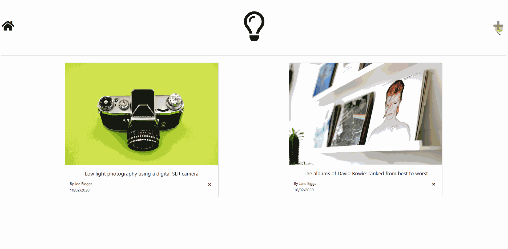

# mern-blog
A multi-page blog web application built using the MERN stack with a Redux store. Posts can be created, stored in a database along with an accompanying image stored on the server, rendered and deleted.

# Demo


# Getting started
These instructions will get you a copy of the project up and running on your local machine for development and testing purposes.

## Prerequisites
Firstly ensure that [Node.js](https://nodejs.org/en/download/) is installed on your system.

## Installation
The following instructions are for a Windows system.

Clone the github repo
```
git clone https://github.com/AIPB07/mern-blog.git
```
Install back-end dependencies
```
cd mern-blog
npm install
```
Install client dependencies
```
cd client
npm install
```

## Configuration
Create a new MongoDB Deployment. You can sign up [here](https://www.mongodb.com/cloud/atlas).

Back in the project's root directory, create a new directory named `config`
```
mkdir config
```
Find and copy your MongoDB URI. Export it in a new file named `keys.js` in the newly created `config` directory. 

E.g.
```
module.exports = mongoURI = "mongodb+srv://<dbuser>:<dbpassword>@test.mongodb.net/test
```
## Usage
To concurrently run the test server and client, in the root directory type
```
npm run dev
```
You can then visit `localhost:3000` to see the project in action.
## License
[MIT](https://choosealicense.com/licenses/mit/)